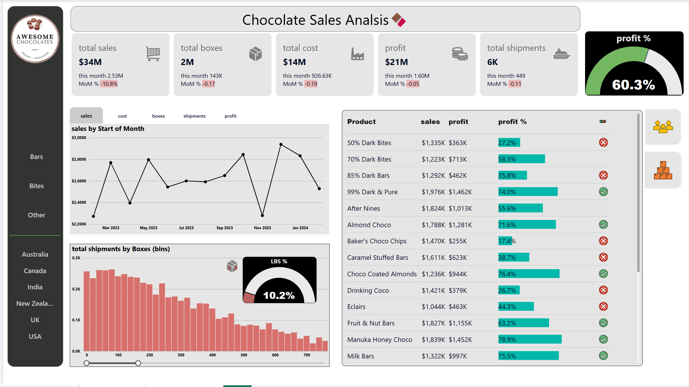
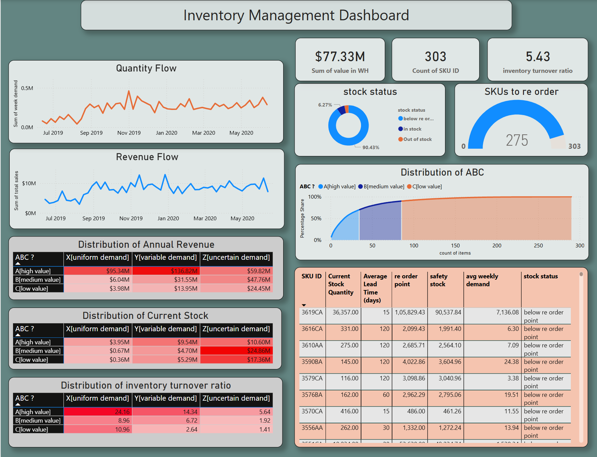
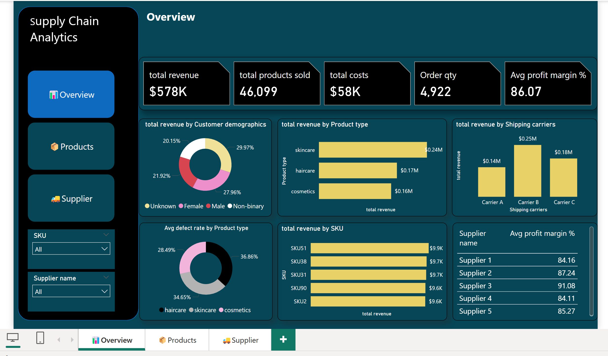
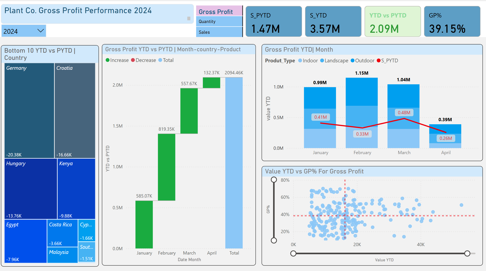
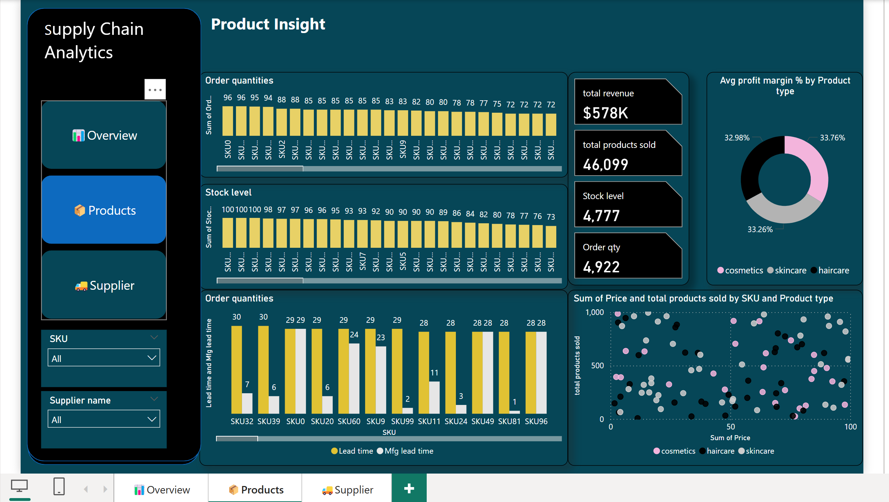
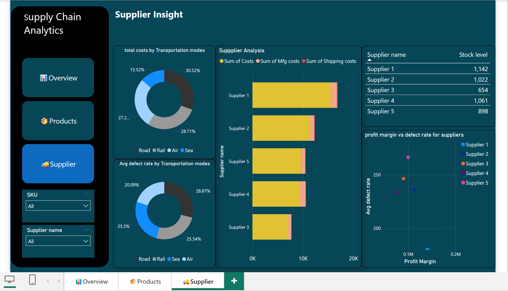

# 📊 Power BI Dashboard Collection

This repository contains interactive dashboards built using **Power BI** for data visualization and analysis.

## 🔹 Features
- Interactive and dynamic dashboards  
- Supports multiple datasets  
- Customizable filters and visuals
- Dynamic titles
- Interactive charts 

## 🛠 Technologies Used
- Power BI  
- Data Modeling  
- DAX (Data Analysis Expressions)
- Bookmarks   
- SQL  
- Machine Learning using Python  

## 📊 Dashboards Included

| Dashboard Name         | Screenshot | Source Folder |
|------------------------|------------|---------------|
| **Sales Analytics** |  | [📂 SalesAnalytics](./SalesAnalytics/) |
| **Inventory Management** |  | [📂 InventoryManagement](./InventoryManagement/) |
| **Product Analytics** |  | [📂 ProductAnalysis](./ProductAnalysis/) |
| **Supply Chain Analysis** |  | [📂 SupplyChainAnalysis](./SupplyChainAnalysis/) |
| **Plants Sales Analysis** |  | [📂 PlantsSaleAnalysis](./PlantSaleAnalysis\/) |

### 📦 **Supply Chain Analysis Pages**
- **Overview Page**  
    
- **Product Insight Page**  
    
- **Supplier Insight Page**  
    

## 📧 Contact
For any queries, reach out to **srinubarnikala222@gmail.com**.

⭐ Star this repository if you find it useful!
