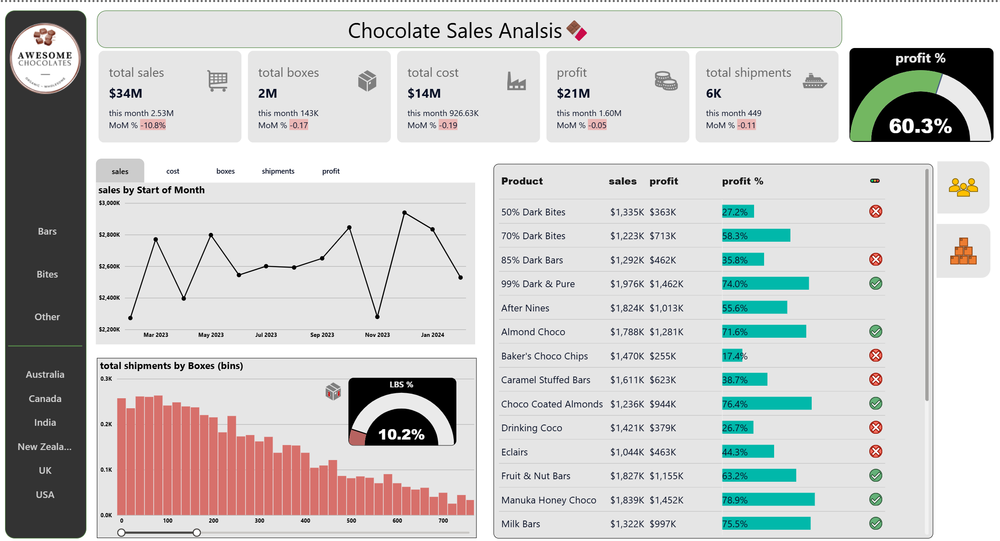

# 📊 Power BI Dashboard Collection

This repository contains interactive dashboards built using **Power BI** for data visualization and analysis.

## 🔹 Features
- Interactive and dynamic dashboards
- Supports multiple datasets
- Customizable filters and visuals

## 🛠 Technologies Used
- Power BI
- Data Modeling
- DAX (Data Analysis Expressions)
- SQL
- Machine Learning using Python
## 📊 Dashboards Included

### **Sales Analytics**  
  
[View Dashboard](https://app.powerbi.com/links/9wWwzHukip?ctid=c6e549b3-5f45-4032-aae9-d4244dc5b2c4&pbi_source=linkShare&bookmarkGuid=64ce19bd-06a5-4331-bc3e-f5360ff1c607)

## 📧 Contact
For any queries, reach out to **srinubarnikala222@gmail.com**.

⭐ Star this repository if you find it useful!

